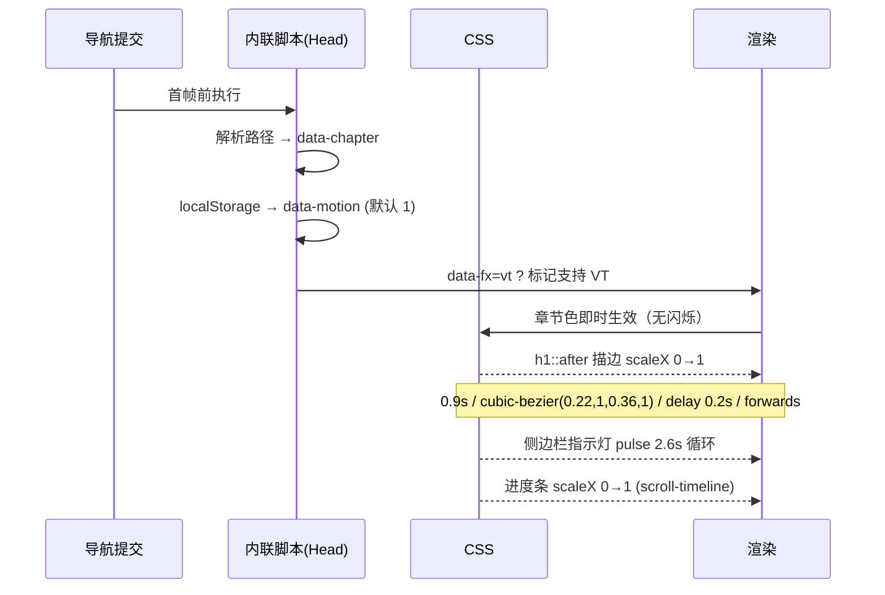
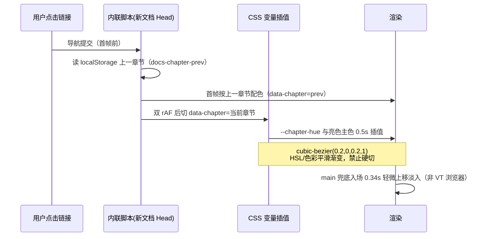
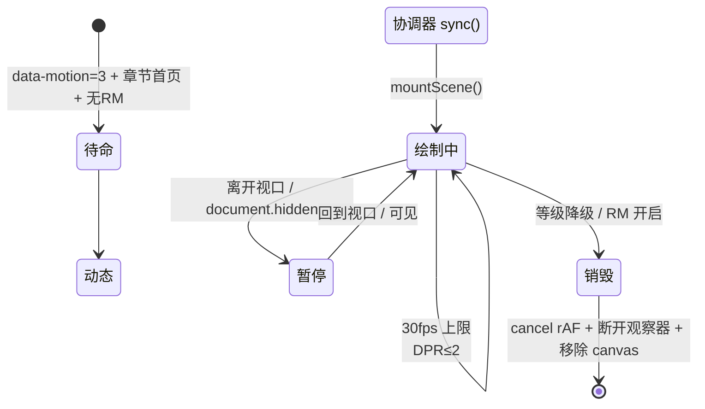

# 动效时序图

所有 CSS 动效仅使用 transform/opacity（GPU 合成层，不触发 layout/paint）；Canvas 由引擎统一限帧。

## 页面加载（L1 默认）

## 章节间导航（色彩插值为主路径）

实测关键数据（Chromium 151，插值帧捕获）：hue 265 → 227(80ms) → 167(240ms) → 160(480ms)。

- 跨文档 View Transitions（`@view-transition`）保留为渐进增强，但在部分 Chromium 构建（含 Playwright Chromium 151）实测 `pagereveal` 不携带 viewTransition、不触发，因此色彩插值不依赖它
- L0 经典模式与 `prefers-reduced-motion: reduce` 下：无插值、无入场动画，色彩瞬时落位
- 浏览器原生跳过条件：`prefers-reduced-motion: reduce`

## Canvas 引擎（L3，仅章节首页）

| 参数 | 值 | 优化点 |
|---|---|---|
| 帧率上限 | 30fps（帧间隔 <33ms 跳过） | 主线程阻塞 ≪ 16ms/帧 |
| DPR | min(devicePixelRatio, 2) | 4K 屏填充率减半 |
| 粒子数 | 面积自适应，60-200 | 低端核数自动减载 |
| Resize | ResizeObserver 重置场景 | 无逐帧尺寸读取（防强制回流） |
| 失败 | try/catch 静默退出 | 文档可读性优先 |

## 关键 CSS 动效参数表

| 动效 | 属性 | 时长 | 缓动 | 触发 | 等级 |
|---|---|---|---|---|---|
| 章节色彩插值 | --chapter-hue / 亮色主色 | 0.5s | cubic-bezier(0.2, 0, 0.2, 1) | 跨章节导航 | L1 |
| 标题渐变描边 | scaleX | 0.9s + 0.2s delay | cubic-bezier(0.22, 1, 0.36, 1) | 加载 | L1 |
| 侧边栏指示灯 | scale+opacity | 2.6s 循环 | ease-in-out | 加载 | L1 |
| 阅读进度条 | scaleX | scroll(root) | linear | 滚动 | L1 |
| 卡片悬停浮起 | translateY+shadow | 0.22s | cubic-bezier(0, 0, 0.2, 1) | 悬停 | L2 |
| 引用块发光 | box-shadow | 0.22s | ease | 悬停 | L2 |
| Callout 入场 | opacity+translateY | 0.4s | cubic-bezier(0, 0, 0.2, 1) | 加载 | L2 |
| 警示图标脉冲 | scale+opacity | 2.2s 循环 | ease-in-out | 加载 | L2 |
| 首页氛围光 | translate3d+scale | 38s/52s 交替 | ease-in-out | 加载 | L3 |
